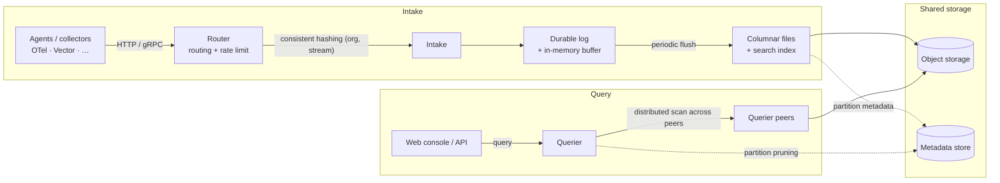

MoleSignal is a **single binary** that serves every role; process configuration selects active roles.
The same binary supports a one-command sandbox or a horizontally scaled cluster.

## Architecture



Logs, metrics, and traces use typed Parquet streams in the same object-storage data plane. Profile
metadata uses the same organization and query model while pprof blobs remain in object storage.

## Node roles

| Role | Responsibilities | State |
|---|---|---|
| `standalone` | HTTP API + all workers in one process | — |
| `router` | Reverse proxy + rate limiting | stateless |
| `intake` | Data intake + durable write-ahead log + buffer + periodic flush to columnar files | local log (≤ flush window) |
| `querier` | Distributed scan endpoint + query execution | stateless |
| `compactor` | Periodic file merge + retention cleanup | stateless |
| `alert_manager` | Rule evaluation, escalation, reports, RCA maintenance, and connector runners | stateless |

Roles are selected with the `[node].roles` config (or `MS_NODE.ROLES`). Only the intake holds
local state — a WAL within the flush window — so every other role scales freely.

## Deployment options

<Tabs>
  <Tab title="Docker Compose">
    The repo ships two profiles:

    ```bash
    # Everything in one process — great for evaluation
    docker compose -f deploy/docker/docker-compose.yaml --profile standalone up

    # Separate roles — closer to production
    docker compose -f deploy/docker/docker-compose.yaml --profile multirole up
    ```

    The checked-in Compose file publishes `5080` and internal `5082`, but not external OTLP gRPC
    `4317`. To send OTLP gRPC from the host, add a `4317:4317` mapping to the standalone or
    intake service. Do not use `5082` as a substitute.

    <Warning>
      `connector` is not a current runtime role. If the checkout still contains a legacy
      `molesignal-connector` service, remove the legacy service; connector runners are owned by `alert_manager`.
    </Warning>
  </Tab>
  <Tab title="Kubernetes">
    Manifests live in [`deploy/k8s/`](https://github.com/molesignal/molesignal/tree/main/deploy/k8s).
    The same image serves all roles; set `MS_NODE.ROLES` per Deployment/StatefulSet. The intake
    runs as a StatefulSet with a PVC for the WAL; every other component is a stateless Deployment.
  </Tab>
</Tabs>

## Dependencies

- **Postgres** — metadata, IAM, streams, alerts, reports, Agent resources, and cluster state.
- **Object store** — `local`, `s3` (and S3-compatible: MinIO, R2, Aliyun OSS), `azure`, or `gcs`.

## Operations

- **Single binary**, same image for all roles.
- **Prometheus `/metrics`** with fixed-cardinality cache, object-store, intake, query, alerting, and
  self-observability metrics.
- **Health probes** — `/api/v1/readyz` gates traffic on WAL replay; `/api/v1/healthz` separately
  reports subsystem degradation, including object-storage probes.
- **TLS + ACME** — optional automatic certificates via `[http.tls]` (HTTP-01 challenge, Let's Encrypt).
- **External protocols** — HTTP `5080`, OTLP gRPC `4317`, optional Flight SQL `5083`; keep internal
  gRPC `5082` private.

See [Configuration](/en-US/configuration) for the full settings reference.
