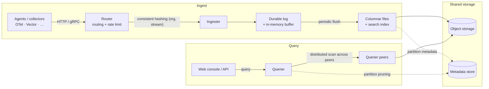

MoleSignal is a **single binary** that serves every role; you choose which roles a process runs.
That makes it equally comfortable as a one-command sandbox or a horizontally-scaled cluster.

## Architecture



The crucial point: logs, metrics, and traces land in the **same** columnar files (different streams,
one physical store), so a single query joins across them natively — no cross-store federation.

## Node roles

| Role | What it runs | State |
|---|---|---|
| `standalone` | HTTP API + all workers in one process | — |
| `router` | Reverse proxy + rate limiting | stateless |
| `ingester` | Data ingest + durable write-ahead log + buffer + periodic flush to columnar files | local log (≤ flush window) |
| `querier` | Distributed scan endpoint + query execution | stateless |
| `compactor` | Periodic file merge + retention cleanup | stateless |
| `alert_manager` | Rule evaluation + escalation dispatch | stateless |

Roles are selected with the `[node].roles` config (or `MS_NODE.ROLES`). Only the ingester holds
local state — a WAL within the flush window — so every other role scales freely.

## Deployment options

<Tabs>
  <Tab title="Docker Compose">
    The repo ships two profiles:

    ```bash
    # Everything in one process — great for evaluation
    docker compose -f deploy/docker/docker-compose.yaml --profile standalone up

    # Separate roles — closer to production
    docker compose -f deploy/docker/docker-compose.yaml --profile multirole up
    ```
  </Tab>
  <Tab title="Kubernetes">
    Manifests live in [`deploy/k8s/`](https://github.com/molesignal/molesignal/tree/main/deploy/k8s).
    The same image serves all roles; set `MS_NODE.ROLES` per Deployment/StatefulSet. The ingester
    runs as a StatefulSet with a PVC for its WAL; everything else is a stateless Deployment.
  </Tab>
</Tabs>

## Dependencies

- **Postgres** — metadata (`FileMeta`, streams, alerts, identity).
- **Object store** — `local`, `s3` (and S3-compatible: MinIO, R2, Aliyun OSS), `azure`, or `gcs`.

## Operations

- **Single binary**, same image for all roles.
- **Prometheus `/metrics`** with rich cache / object_store / ingester / compactor metrics.
- **Health probes** — readiness is gated by ingester WAL replay plus an object-store round-trip probe.
- **TLS + ACME** — optional automatic certificates via `[http.tls]` (HTTP-01 challenge, Let's Encrypt).

See [Configuration](/en/configuration) for the full settings reference.
