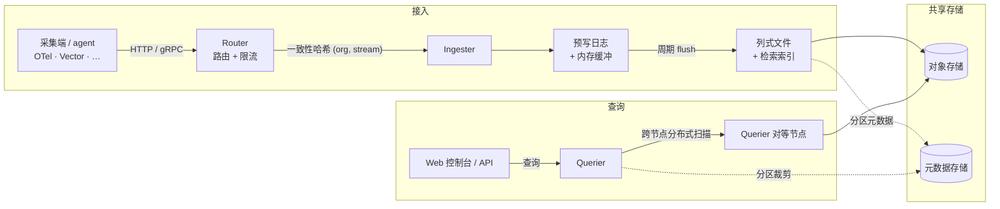

MoleSignal 是一个**单一二进制**，服务所有角色；进程配置决定运行角色。同一个二进制既能当作
一条命令的沙箱，也能横向扩展成集群。

## 架构



日志、指标与链路使用同一对象存储数据平面中的类型化 Parquet 数据流。性能剖析元数据使用相同的组织与查询模型，pprof 文件保存在对象存储中。

## 节点角色

| 角色 | 启动什么 | 状态 |
|---|---|---|
| `standalone` | 同进程内 HTTP API + 所有 worker | — |
| `router` | 反向代理 + 限流 | 无状态 |
| `ingester` | 数据接入 + 预写日志 + 缓冲 + 周期 flush 到列式文件 | 本地日志（≤ flush 窗口） |
| `querier` | 分布式扫描端 + 查询执行 | 无状态 |
| `compactor` | 周期合并文件 + 清理过期数据 | 无状态 |
| `alert_manager` | 规则评估、升级、报告、RCA 维护与 Connector Runner | 无状态 |

角色由 `[node].roles` 配置（或 `MS_NODE.ROLES`）选择。只有 ingester 持有本地状态（flush 窗口内的
WAL），因此其他角色都能自由扩缩。

## 部署方式

<Tabs>
  <Tab title="Docker Compose">
    仓库提供两个 profile：

    ```bash
    # 全部在一个进程内 —— 适合评估
    docker compose -f deploy/docker/docker-compose.yaml --profile standalone up

    # 角色分离 —— 更接近生产
    docker compose -f deploy/docker/docker-compose.yaml --profile multirole up
    ```

    当前仓库内的 Compose 文件只发布 `5080` 和内部端口 `5082`，没有发布对外 OTLP gRPC
    `4317`。如需从宿主机发送 OTLP gRPC，请给 standalone 或 ingester 服务增加
    `4317:4317` 映射；不要用 `5082` 替代。

    <Warning>
      `connector` 不是当前运行角色。如果 Checkout 仍包含旧
      `molesignal-connector` 服务，请移除该旧服务；Connector Runner 由 `alert_manager` 持有。
    </Warning>
  </Tab>
  <Tab title="Kubernetes">
    清单位于 [`deploy/k8s/`](https://github.com/molesignal/molesignal/tree/main/deploy/k8s)。
    同一镜像服务所有角色；按 Deployment/StatefulSet 设置 `MS_NODE.ROLES`。ingester 以 StatefulSet
    运行并为 WAL 挂 PVC；其他组件均为无状态 Deployment。
  </Tab>
</Tabs>

## 依赖

- **Postgres** —— 元数据、IAM、数据流、告警、报告、Intelligence 资源与集群状态。
- **对象存储** —— `local`、`s3`（及 S3 兼容：MinIO、R2、阿里云 OSS）、`azure`、`gcs`。

## 运维

- **单一二进制**，所有角色同一镜像。
- **Prometheus `/metrics`**，包含固定基数的缓存、对象存储、采集、查询、告警与平台可观测性指标。
- **健康探针** —— `/api/v1/readyz` 按 WAL 回放状态控制流量就绪；
  `/api/v1/healthz` 独立报告对象存储探测等子系统降级。
- **TLS + ACME** —— 经 `[http.tls]` 可选自动证书（HTTP-01 challenge，Let's Encrypt）。
- **外部协议** —— HTTP `5080`、OTLP gRPC `4317`、可选 Flight SQL `5083`；内部 gRPC
  `5082` 应保持私有。

完整设置参考见 [配置](/zh-Hans/configuration)。
