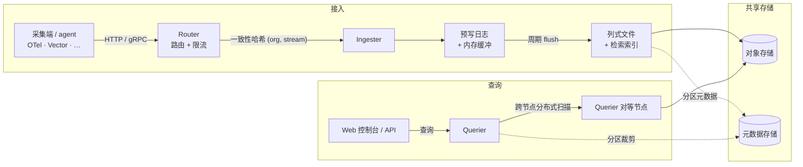

MoleSignal 是一个**单一二进制**，服务所有角色；你来选择某个进程运行哪些角色。这让它既能当作
一条命令的沙箱，也能横向扩展成集群。

## 架构



关键点：日志、指标、追踪落进**同一批**列式文件（不同的流、同一物理存储），所以一条查询可以原生地在它们之间 join —— 没有跨存储联邦。

## 节点角色

| 角色 | 启动什么 | 状态 |
|---|---|---|
| `standalone` | 同进程内 HTTP API + 所有 worker | — |
| `router` | 反向代理 + 限流 | 无状态 |
| `ingester` | 数据接入 + 预写日志 + 缓冲 + 周期 flush 到列式文件 | 本地日志（≤ flush 窗口） |
| `querier` | 分布式扫描端 + 查询执行 | 无状态 |
| `compactor` | 周期合并文件 + 清理过期数据 | 无状态 |
| `alert_manager` | 规则评估 + 升级派发 | 无状态 |

角色由 `[node].roles` 配置（或 `MS_NODE.ROLES`）选择。只有 ingester 持有本地状态（flush 窗口内的
WAL），因此其余角色都能自由扩缩。

## 部署方式

<Tabs>
  <Tab title="Docker Compose">
    仓库提供两个 profile：

    ```bash
    # 全部在一个进程内 —— 适合评估
    docker compose -f deploy/docker/docker-compose.yaml --profile standalone up

    # 角色分离 —— 更接近生产
    docker compose -f deploy/docker/docker-compose.yaml --profile multirole up
    ```
  </Tab>
  <Tab title="Kubernetes">
    清单位于 [`deploy/k8s/`](https://github.com/molesignal/molesignal/tree/main/deploy/k8s)。
    同一镜像服务所有角色；按 Deployment/StatefulSet 设置 `MS_NODE.ROLES`。ingester 以 StatefulSet
    运行并为 WAL 挂 PVC；其余皆为无状态 Deployment。
  </Tab>
</Tabs>

## 依赖

- **Postgres** —— 元数据（`FileMeta`、流、告警、身份）。
- **对象存储** —— `local`、`s3`（及 S3 兼容：MinIO、R2、阿里云 OSS）、`azure`、`gcs`。

## 运维

- **单一二进制**，所有角色同一镜像。
- **Prometheus `/metrics`**，含丰富的 cache / object_store / ingester / compactor 指标。
- **健康探针** —— readiness 由 ingester WAL 回放加对象存储往返探测共同把关。
- **TLS + ACME** —— 经 `[http.tls]` 可选自动证书（HTTP-01 challenge，Let's Encrypt）。

完整设置参考见 [配置](/zh-Hans/configuration)。
